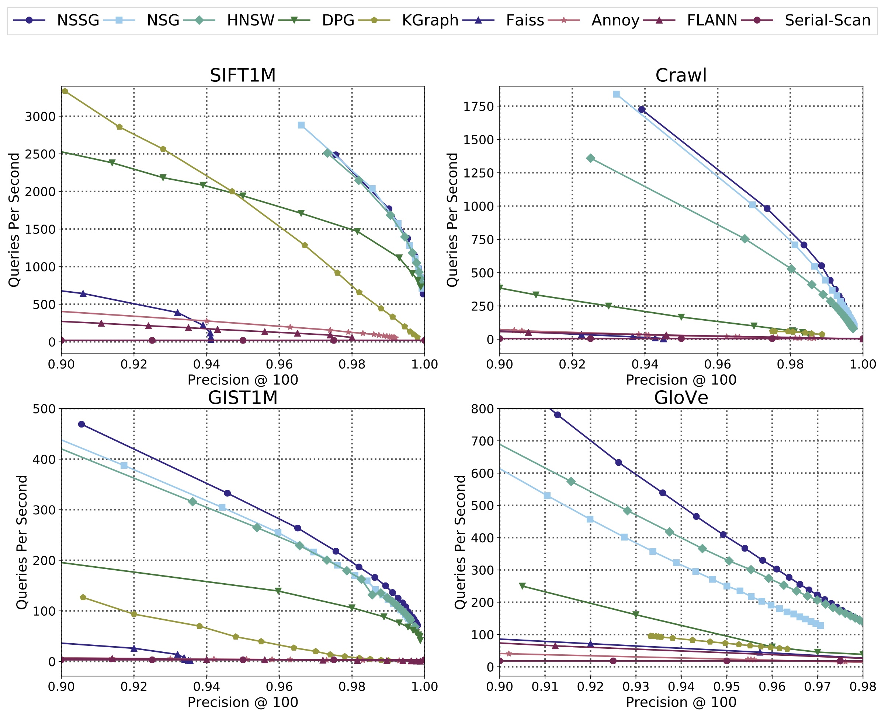

SSG : Satellite System Graph For Approximate Nearest Neighbor Search
======

SSG is a graph-based approximate nearest neighbor search (ANNS) algorithm. It provides a flexible and efficient solution for the metric-free large-scale ANNS on dense real vectors.
It implements the algorithm of our paper: [Satellite System Graph: Towards the Efficiency Up-Boundary of Graph-Based Approximate Nearest Neighbor Search](https://arxiv.org/abs/1907.06146)

Benchmark datasets
------

| Data set  | Download                 | dimension | nb base vectors | nb query vectors | original website                                               |
|-----------|--------------------------|-----------|-----------------|------------------|----------------------------------------------------------------|
| SIFT1M    |[original website](http://corpus-texmex.irisa.fr/)| 128       | 1,000,000       | 10,000           | [original website](http://corpus-texmex.irisa.fr/)             |
| GIST1M    |[original website](http://corpus-texmex.irisa.fr/)| 128       | 1,000,000       | 1,000            | [original website](http://corpus-texmex.irisa.fr/)             |
| Crawl     | [crawl.tar.gz](http://downloads.zjulearning.org.cn/data/crawl.tar.gz) (1.7GB)     | 300       | 1,989,995       | 10,000           | [original website](http://commoncrawl.org/)                    |
| GloVe-100 | [glove-100.tar.gz](http://downloads.zjulearning.org.cn/data/glove-100.tar.gz) (424MB) | 100       | 1,183,514       | 10,000           | [original website](https://nlp.stanford.edu/projects/glove/)   |
| Deep100M  | deep100m.tar.gz* (34GB)  | 96        | 100,000,000     | 10,000           | [original website](http://sites.skoltech.ru/compvision/noimi/) |

* For Deep100M we will provide the download link upon request

ANNS performance
------

The performance was tested without parallelism.
Among all the ***graph-based algorithms***, NSG and SSG has ***the smallest index size***.



Compared Algorithms:

#### Tree-based

* [FLANN](http://www.cs.ubc.ca/research/flann/)
* [Annoy](https://github.com/spotify/annoy)

#### Quantization-based

* [Faiss](https://github.com/facebookresearch/faiss)

#### Graph-based

* [KGraph](http://www.kgraph.org)
* [HNSW](https://github.com/searchivarius/nmslib)
* [DPG](https://github.com/DBWangGroupUNSW/nns_benchmark)
* [NSG](https://github.com/zjulearning/nsg) - our previous [paper](http://www.vldb.org/pvldb/vol12/p461-fu.pdf), [code](https://github.com/ZJULearning/nsg).

> Please see our [NSG paper](http://www.vldb.org/pvldb/vol12/p461-fu.pdf) for the performance of other graph-based algorithms - [FANNG](https://pdfs.semanticscholar.org/9ea6/5687a21c869fce7ecf17ca25ffcadbf77d69.pdf).

How to use
------

### Compile

* Prerequisite : openmp, cmake, boost
* Compile:
    1. Go to the root directory of faiss, it's under the directory of extern_libraries aside of ours.
    2. Execute the following commands:

```bash
$ cd /path/to/project
$ mkdir -p build && cd build
$ cmake .. && make -j
```

### Building SSG Index

The main interfaces and classes have its respective test codes under directory `tests/`.

Please follow the instructions below to build the SSG index.

#### a) Build a kNN graph

Firstly, we need to prepare a kNN graph.

We suggest you use our [efanna\_graph](https://github.com/ZJULearning/efanna\_graph) to build this kNN graph. But you can also use any alternatives you like, such as KGraph or faiss.

#### b) Convert the kNN graph to an SSG

For example:

```bash
$ cd /path/to/project/build/tests/
$ ./test_ssg_index data_path knn_graph_path L R Angle ssg_path
```

* **data\_path** is the path of the origin data.
* **knn\_graph\_path** is the path of the pre-built kNN graph.
* **L** controls the quality of the NSG, the larger the better, L > R.
* **R** controls the index size of the graph, the best R is related to the intrinsic dimension of the dataset.
* **Angle** controls the angle between two edges.
* **ssg\_path** is the path where the result SSG stored.

### Approximate Nearest Neighbor Search using SSG

For example:

```bash
$ cd /path/to/project/build/tests/
$ ./test_ssg_optimized_search data_path query_path ssg_path search_L search_K result_path [random_seed]
```

* **data\_path** is the path of the origin data.
* **query\_path** is the path of the query data.
* **ssg\_path** is the path of the pre-built SSG.
* **search\_L** controls the quality of the search results, the larger the better but slower (must larger than search\_K).
* **search\_K** controls the number of neighbors we want to find.
* **result\_path** is the path of the result neighbors.
* **random\_seed** (optional) is the random seed.

> **NOTE:** For now, we only provide interface for search for only one query at a time, and test the performance with single thread.

> **NOTE:** Data alignment is essential for the correctness of our procedure, because we use SIMD instructions for acceleration of numerical computing such as AVX and SSE2.
You should use it to ensure your data elements (feature) is aligned with 8 or 16 int or float. For example, if your features are of dimension 70, then it should be extend to dimension 72. And the last 2 dimension should be filled with 0 to ensure the correctness of the distance computing. And this is what data\_align() does.

> **NOTE:** Only data-type int32 and float32 are supported for now.

### Python API

#### Install

```bash
$ cd /path/to/project/
$ python setup.py install
```

#### Usage

> NOTE: currently Python API only supports `search` method.

```python
import numpy as np
import pyssg

data = load_fvecs("/path/to/sift_base.fvecs")
ndata, dim = data.shape

pyssg.set_seed(1234)
index = pyssg.IndexSSG(dim, ndata)
index.load("/path/to/ssg", data)

k, l = 100, 300
query = np.randn(dim).astype(np.float32)
knn = index.search(query, k, l)
print(knn)
```

Please refer to `tests/test_python_query.py` for a real-world example.

## Parameters used in Our Paper

### SSG Building

We use the following parameters to get the SSG index in Fig. 6 of [our paper](https://arxiv.org/abs/TODO).

We use [efanna_graph](https://github.com/ZJULearning/efanna_graph) to build the kNN graph

#### Step 1. Build kNN Graph

+ Tool: [efanna_graph](https://github.com/ZJULearning/efanna_graph)
+ Parameters:

|  Dataset  |  K  |  L  | iter |  S |  R  |
|:---------:|:---:|:---:|:----:|:--:|:---:|
| SIFT1M    | 200 | 200 |  12  | 10 | 100 |
| GIST1M    | 400 | 400 |  12  | 15 | 100 |
| Crawl     | 400 | 420 |  12  | 15 | 100 |
| GloVe-100 | 400 | 420 |  12  | 20 | 200 |

+ Commands:

```bash
$ efanna_graph/tests/test_nndescent sift.fvecs sift_200nn.knng 200 200 12 10 100
$ efanna_graph/tests/test_nndescent gist.fvecs gist_400nn.knng 400 400 12 15 100
$ efanna_graph/tests/test_nndescent crawl.fvecs crawl_400nn.knng 400 420 12 15 100
$ efanna_graph/tests/test_nndescent glove-100.fvecs glove-100_400nn.knng 400 420 12 15 200
```

#### Step 2. Convert kNN Graph to SSG

+ Parameters:

|  Dataset  |  L  |  R  | Angle |
|:---------:|:---:|:---:|:-----:|
| SIFT1M    | 100 | 50  |  60   |
| GIST1M    | 500 | 70  |  60   |
| Crawl     | 500 | 40  |  60   |
| GloVe-100 | 500 | 50  |  60   |

+ Commands:

```bash
$ ./test_ssg_index sift.fvecs sift_200nn.knng 100 50 60 sift.ssg
$ ./test_ssg_index gist.fvecs gist_400nn.knng 500 70 60 gist.ssg
$ ./test_ssg_index crawl.fvecs crawl_400nn.knng 500 40 60 crawl.ssg
$ ./test_ssg_index glove-100.fvecs glove-100_400nn.knng 500 50 60 glove-100.ssg
```

### SSG Search

+ `search_L`: range from `search_K` to 2000
+ `random_seed`: 161803398

## Pre-built kNN Graph and NSG Index

Here we provide our pre-built kNN graphs and SSG index files used in our papar's experiments.

|  Dataset  |  kNN Graph  |  SSG Index  |
|:---------:|:---:|:---:|
| SIFT1M    | [sift_200nn.knng](http://downloads.zjulearning.org.cn/ssg/sift_200nn.knng) | [sift.ssg](http://downloads.zjulearning.org.cn/ssg/sift.ssg)  |
| GIST1M    | [gist_400nn.knng](http://downloads.zjulearning.org.cn/ssg/gist_400nn.knng) | [gist.ssg](http://downloads.zjulearning.org.cn/ssg/gist.ssg)  |
| Crawl     | [crawl_400nn.knng](http://downloads.zjulearning.org.cn/ssg/crawl_400nn.knng) | [crawl.ssg](http://downloads.zjulearning.org.cn/ssg/crawl.ssg)  |
| GloVe-100 | [glove_400nn.knng](http://downloads.zjulearning.org.cn/ssg/glove-100_400nn.knng) | [glove.ssg](http://downloads.zjulearning.org.cn/ssg/glove-100.ssg)  |
